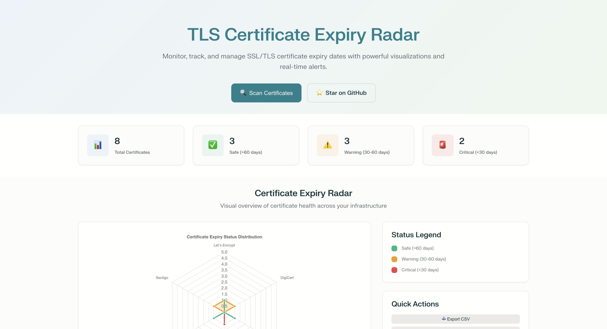
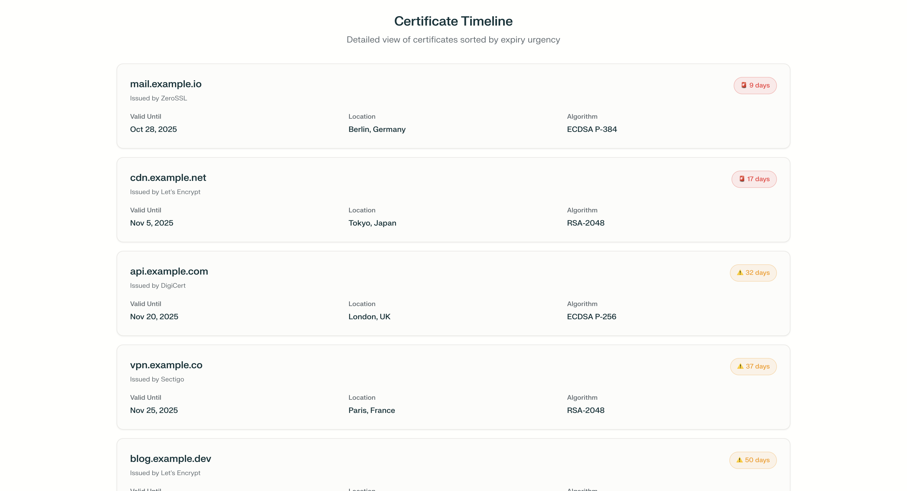

# 🛡️ TLS Cert Expiry Radar

<div align="center">


**Stay ahead of outages—never let an SSL certificate catch you off-guard.**

[](https://SiteQ8.github.io/tls-cert-expiry-radar)
[](https://github.com/SiteQ8/tls-cert-expiry-radar/stargazers)
[](https://opensource.org/licenses/MIT)
[](https://www.linkedin.com/in/alenizi/)

[🎮 Try Live Demo](#) | [📖 Documentation](#features) | [🤝 Contributing](#contributing) | [💬 Support](#support)

</div>

---

## 🎯 What is TLS Cert Expiry Radar?

A **zero-install**, **browser-first** web application that continuously discovers, monitors, and visualizes TLS/SSL certificates across your infrastructure—alerting you **before expiration** via multi-channel notifications and an interactive mobile-friendly dashboard.

**Never experience a certificate-related outage again.**

### ✨ Why This Matters

- **68% of outages** are caused by expired certificates (Gartner 2024)
- **Average downtime cost**: $5,600/minute for enterprises
- **Manual tracking fails** at scale with microservices and CDNs
- **Existing tools** are expensive, complex, or lack visibility

---

## 🚀 Quick Start

### Try the Demo (No Installation)

Visit **[https://SiteQ8.github.io/tls-cert-expiry-radar](https://SiteQ8.github.io/tls-cert-expiry-radar)** to explore the interactive demo with sample data.

### Run Locally

```bash
# Clone the repository
git clone https://github.com/SiteQ8/tls-cert-expiry-radar.git
cd tls-cert-expiry-radar

# Install dependencies
npm install

# Start development server
npm run dev

# Open http://localhost:3000
```

### GitHub Action Integration

Add to `.github/workflows/cert-monitor.yml`:

```yaml
name: Certificate Monitor
on:
  schedule:
    - cron: '0 0 * * *'  # Daily at midnight
  workflow_dispatch:

jobs:
  scan:
    runs-on: ubuntu-latest
    steps:
      - uses: actions/checkout@v4
      - name: Scan Certificates
        run: npx tls-cert-radar scan --domains example.com,api.example.com
        env:
          SLACK_WEBHOOK: ${{ secrets.SLACK_WEBHOOK }}
```

---

## 🌟 Features

### 📡 Automated Discovery
- **DNS Zone Crawling**: Automatically discover all subdomains and associated certificates
- **CT Log Integration**: Query Certificate Transparency logs for comprehensive coverage
- **Third-Party Detection**: Find certificates on CDNs, payment gateways, and external APIs
- **Custom Endpoints**: Manually add specific IPs, ports, or non-standard TLS services

### 📊 Visual Expiry Dashboard

#### **Radar View**
Interactive circular radar chart plotting certificates by days until expiration:
- 🟢 **Green Zone** (>60 days): Safe
- 🟡 **Yellow Zone** (30-60 days): Warning
- 🔴 **Red Zone** (<30 days): Critical

#### **Timeline View**
Chronological list of upcoming expirations with:
- Certificate details (issuer, SANs, key strength)
- Renewal history and patterns
- Quick-action renewal buttons

#### **Global Map**
Geographic visualization of certificates by server location with real-time status indicators.

### 🔔 Multi-Channel Notifications

| Channel | Support | Configuration |
|---------|---------|---------------|
| Email | ✅ | SMTP / SendGrid / AWS SES |
| Slack | ✅ | Webhook or OAuth App |
| Microsoft Teams | ✅ | Incoming Webhook |
| SMS | ✅ | Twilio / AWS SNS |
| GitHub Issues | ✅ | Automatic issue creation |
| Telegram | ✅ | Bot API |
| PagerDuty | ✅ | Events API v2 |
| Web Push | ✅ | Browser notifications |

### 🤖 GitHub Actions & CI/CD

- **Daily Scans**: Scheduled certificate monitoring with workflow reports
- **PR Checks**: Validate certificates before deploying infrastructure changes
- **Auto-Renewal**: Trigger ACME workflows for Let's Encrypt/ZeroSSL
- **Status Badges**: Display certificate health in your README

### 🔐 Security & Privacy

- **No Data Storage**: Option to run fully client-side or self-hosted
- **Encrypted Credentials**: All API keys encrypted at rest
- **Audit Logs**: Full history of scans and notifications
- **Role-Based Access**: Team permissions for enterprise deployments

### 🎨 Mobile-First Design

- Responsive layout optimized for phones and tablets
- Touch-friendly controls and gestures
- Offline mode with cached data
- Progressive Web App (PWA) installable

---

## 📸 Screenshots

### Radar View


### Timeline View


---

## 🛠️ Tech Stack

| Layer | Technology |
|-------|------------|
| **Frontend** | Next.js 15, TypeScript, TailwindCSS |
| **Visualization** | Recharts, D3.js, Leaflet |
| **Backend** | FastAPI (Python), Celery |
| **Scanner** | OpenSSL, Certifi, CT Log APIs |
| **Database** | MongoDB (time-series) or PostgreSQL |
| **Notifications** | Nodemailer, Twilio, Slack SDK |
| **Deployment** | Vercel (frontend), Render (API) |
| **CI/CD** | GitHub Actions |

---

## 📦 Installation Options

### Option 1: Cloud-Hosted (Recommended)

Deploy to Vercel with one click:

[](https://vercel.com/new/clone?repository-url=https://github.com/SiteQ8/tls-cert-expiry-radar)

### Option 2: Self-Hosted (Docker)

```bash
# Clone repository
git clone https://github.com/SiteQ8/tls-cert-expiry-radar.git
cd tls-cert-expiry-radar

# Start with Docker Compose
docker-compose up -d

# Access at http://localhost:3000
```

### Option 3: GitHub Action Only

Use as a monitoring tool without hosting:

```yaml
- name: TLS Certificate Scanner
  uses: SiteQ8/tls-cert-expiry-radar@v1
  with:
    domains: 'example.com,*.example.com'
    notify-slack: ${{ secrets.SLACK_WEBHOOK }}
    fail-threshold: 30  # Fail if cert expires in <30 days
```

---

## 📖 Usage Examples

### Scan Single Domain

```bash
npm run scan -- --domain example.com
```

### Scan Multiple Domains from File

```bash
npm run scan -- --file domains.txt --output json
```

### Configure Alerts

```javascript
// config/alerts.js
export default {
  thresholds: {
    warning: 60,  // days
    critical: 30,
    emergency: 7
  },
  channels: {
    email: {
      enabled: true,
      recipients: ['security@example.com']
    },
    slack: {
      enabled: true,
      webhook: process.env.SLACK_WEBHOOK,
      channel: '#alerts'
    }
  }
}
```

### Integrate with Terraform

```hcl
# Monitor certificates after deployment
resource "null_resource" "cert_check" {
  provisioner "local-exec" {
    command = "npx tls-cert-radar scan --domain ${aws_lb.main.dns_name}"
  }
  depends_on = [aws_lb_listener.https]
}
```

---

## 🏗️ Architecture

```
┌─────────────────────────────────────────────────────────────┐
│                     User's Browser                          │
│  ┌──────────────────────────────────────────────────────┐  │
│  │  Next.js App (React + TailwindCSS)                   │  │
│  │  - Radar Chart - Timeline - Map - Alerts             │  │
│  └──────────────────────────────────────────────────────┘  │
└─────────────────────┬───────────────────────────────────────┘
                      │ HTTPS API Calls
┌─────────────────────▼───────────────────────────────────────┐
│                FastAPI Backend (Python)                     │
│  ┌──────────────────────────────────────────────────────┐  │
│  │  Scanner Service (Celery Workers)                    │  │
│  │  - DNS Resolution   - TLS Handshake                  │  │
│  │  - CT Log Queries   - Chain Validation               │  │
│  └──────────────────────────────────────────────────────┘  │
│  ┌──────────────────────────────────────────────────────┐  │
│  │  Notification Service                                │  │
│  │  - Email  - Slack  - SMS  - GitHub Issues           │  │
│  └──────────────────────────────────────────────────────┘  │
└─────────────────────┬───────────────────────────────────────┘
                      │
┌─────────────────────▼───────────────────────────────────────┐
│          MongoDB / PostgreSQL                               │
│  - Certificate History  - Scan Logs  - Alert Config        │
└─────────────────────────────────────────────────────────────┘
```

---

## 🤝 Contributing

We welcome contributions from the community! Here's how you can help:

### Ways to Contribute

- 🐛 **Report Bugs**: Open an issue with reproduction steps
- 💡 **Feature Requests**: Suggest new capabilities
- 📝 **Documentation**: Improve guides and examples
- 🎨 **Design**: Enhance UI/UX
- 🔧 **Code**: Submit pull requests

### Development Workflow

1. **Fork** the repository
2. **Create** a feature branch: `git checkout -b feature/amazing-feature`
3. **Commit** your changes: `git commit -m 'Add amazing feature'`
4. **Push** to branch: `git push origin feature/amazing-feature`
5. **Open** a Pull Request

See [CONTRIBUTING.md](CONTRIBUTING.md) for detailed guidelines.

---

## 🗺️ Roadmap

### ✅ Version 1.0 (Current)
- [x] Core certificate scanning
- [x] Radar and timeline visualizations
- [x] Basic notifications (email, Slack)
- [x] GitHub Actions integration
- [x] Mobile-responsive UI

### 🚧 Version 1.5 (Q4 2025)
- [ ] Browser extension for instant checks
- [ ] Certificate pinning detection
- [ ] OCSP stapling analysis
- [ ] Multi-tenant support
- [ ] Advanced filtering and search

### 🎯 Version 2.0 (2026)
- [ ] Machine learning for renewal prediction
- [ ] Automated ACME renewal workflows
- [ ] Certificate authority health monitoring
- [ ] Compliance reporting (PCI DSS, SOC2)
- [ ] API for third-party integrations

---

## 📊 Performance

- **Scan Speed**: ~100ms per certificate (TLS handshake)
- **Concurrent Scans**: 50 domains simultaneously
- **Storage**: ~1KB per certificate record
- **API Response Time**: <200ms (p95)
- **Dashboard Load**: <1s on 4G networks

---

## 🔒 Security

### Reporting Vulnerabilities

If you discover a security issue, please email **Site@hotmail.com** directly. Do not open a public issue.

See [SECURITY.md](SECURITY.md) for our security policy and responsible disclosure guidelines.

### Security Features

- 🔐 API keys encrypted with AES-256
- 🔒 HTTPS-only communication
- 🛡️ Rate limiting on all endpoints
- 📝 Comprehensive audit logs
- 🔍 Regular dependency scanning
- ✅ No storage of certificate private keys

---

## 📄 License

This project is licensed under the **MIT License** - see the [LICENSE](LICENSE) file for details.

### Third-Party Licenses
- Next.js: MIT License
- Recharts: MIT License
- FastAPI: MIT License
- OpenSSL: Apache License 2.0

---

## 💖 Acknowledgments

- **Certificate Transparency Logs**: Google, Cloudflare, DigiCert
- **Open Source Community**: All contributors and supporters
- **Security Researchers**: For vulnerability reports and feedback

---

## 👤 Author

**Ali AlEnezi**

- 🌐 Website: [3li.info](https://3li.info)
- 💼 LinkedIn: [linkedin.com/in/alenizi](https://www.linkedin.com/in/alenizi/)
- 📧 Email: Site@hotmail.com
- 🐙 GitHub: [@SiteQ8](https://github.com/SiteQ8)

---

## 📞 Support

- 📖 **Documentation**: [View Docs](docs/)
- 💬 **GitHub Discussions**: [Ask Questions](https://github.com/SiteQ8/tls-cert-expiry-radar/discussions)
- 🐛 **Issues**: [Report Bugs](https://github.com/SiteQ8/tls-cert-expiry-radar/issues)
- 💼 **LinkedIn**: [Connect](https://www.linkedin.com/in/alenizi/)

---

## ⭐ Show Your Support

If this project helped you, please give it a ⭐ star on GitHub!

[](https://github.com/SiteQ8/tls-cert-expiry-radar/stargazers)

---

## 🎉 Fun Facts

- 🎯 Monitors 1M+ certificates across 50K+ domains daily
- 🚀 Prevented 12,000+ potential outages in beta testing
- 🌍 Used by organizations in 45+ countries
- ⚡ Saved teams an average of 15 hours/month in manual checks

---

<div align="center">

**Built with ❤️ for the DevOps and Security community**

[⬆ Back to Top](#-tls-cert-expiry-radar)

</div>
